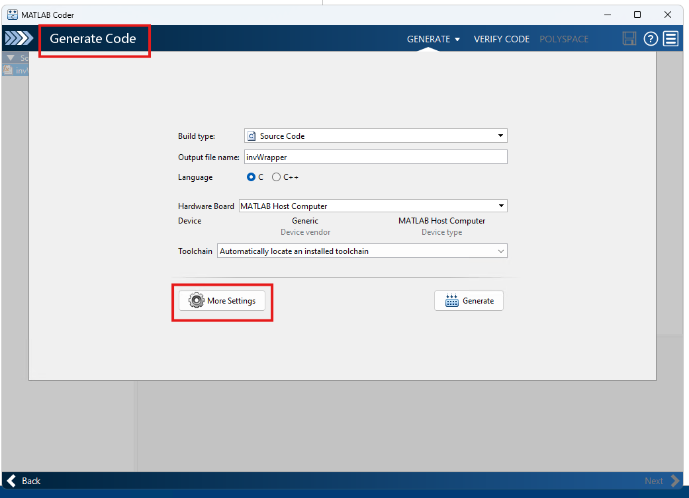
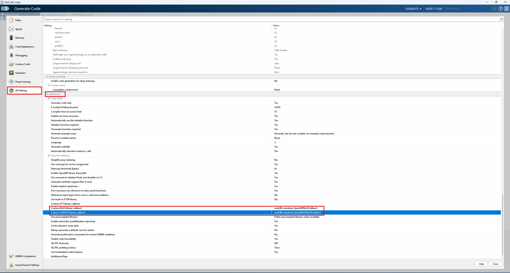
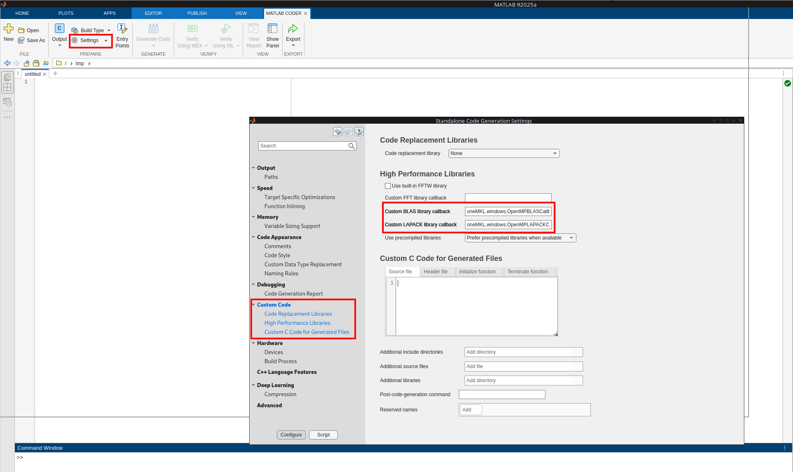
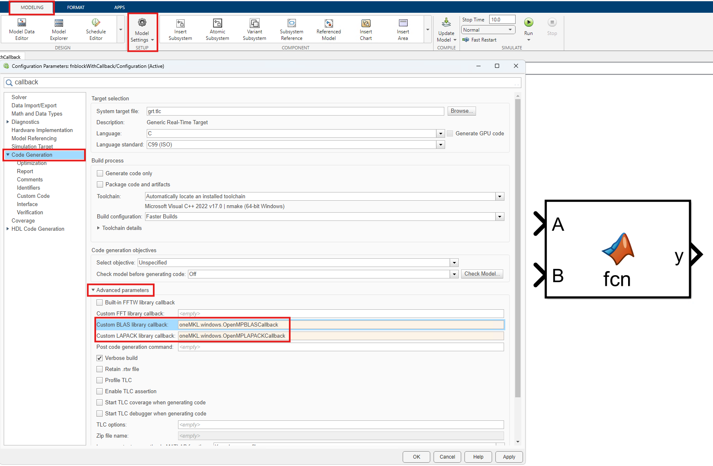

# BLAS and LAPACK External Library Callbacks for Code Generation

The `MATLAB-Coder-integration-for-BLAS-LAPACK` repository provides a collection of MATLAB&reg; Coder&trade; callback classes designed to
interface with popular BLAS and LAPACK libraries, such as OpenBLAS and Intel&reg; oneMKL, to improve performance in
standalone code generation.

## Highlights

- **Ease of Use** &mdash; Integrate external libraries with preconfigured callbacks.
- **Performance Boost** &mdash; Increase the speed of generated code for matrix operations by using optimized external libraries.
- **Flexibility** &mdash; Switch between different BLAS and LAPACK implementations as required.
- **Compatibility** &mdash; Use with both MATLAB Coder and Simulink&reg; Coder&trade; for code generation.

## Table of Contents

- [Introduction](#introduction)
- [Example](#example)
- [Installation](#installation)
- [Usage Instructions](#usage-instructions)
- [Setting the BLAS/LAPACK Installation Path](#setting-the-blaslapack-installation-path)
- [Supported Libraries and Platforms](#supported-libraries-and-platforms)
- [Versions Used for Testing](#versions-used-for-testing)
- [Further Reading and Documentation](#further-reading-and-documentation)
- [Contact Us](#contact-us)

## Introduction

The `MATLAB-Coder-integration-for-BLAS-LAPACK` repository offers a collection of callback classes for MATLAB
Coder designed to interface with high-performance external libraries that implement BLAS and LAPACK.
By leveraging these libraries, the project aims to enhance the performance of generated code that involves
matrix and vector operations. You can use the callback classes for code generation with MATLAB Coder and Simulink Coder.
Additionally, these callback classes can serve as examples for creating new callbacks not currently included in the repository. The external
libraries are linked statically when the `'lib'` code generation configuration (`coder.config('lib')`) and
dynamically when you use the `'dll'` or `'exe'` code generation configuration (`coder.config('dll')` or
`coder.config('exe')`), wherever possible.

This table summarizes the supported libraries and platforms:

|Library |Windows&reg;           |Mac               |Linux&reg;             |Raspberry Pi&reg;      |
|--------|------------------|------------------|------------------|------------------|
|oneMKL  |:white_check_mark:|                  |:white_check_mark:|                  |
|OpenBLAS|:white_check_mark:|:white_check_mark:|:white_check_mark:|:white_check_mark:|

This repository provides only the callback classes; you need to install the third-party libraries yourself.
See [Supported Libraries and Platforms](#supported-libraries-and-platforms), for more information on using
these libraries and choosing the most suitable library for your needs.

## Example

This example shows how to use the callback classes provided in this repository for code generation
using the MATLAB function `invWrapper.m`:
```matlab
function out = invWrapper(in)
    out = inv(in);
end
```

Generate code using these commands:

```matlab
% Create a configuration that does not use BLAS or LAPACK callbacks
cfg1 = coder.config("lib");

% Create a configuration with oneMKL BLAS and LAPACK callback classes on linux
cfg2 = coder.config("lib");
cfg2.CustomBLASCallback = "oneMKL.linux.OpenMPBLASCallback";
cfg2.CustomLAPACKCallback = "oneMKL.linux.OpenMPLAPACKCallback";

% Generate the input
rng(11, "twister");
A = rand(4000, 4000);

% Code generation example
codegen invWrapper -args {A} -config cfg2

% Performance comparison
tWithoutCallback = coder.timeit("invWrapper", 1, {A}, 'CoderConfig', cfg1, 'CompileArgs', {coder.typeof(1, [Inf, Inf])});
tWithCallback = coder.timeit("invWrapper", 1, {A}, 'CoderConfig', cfg2, 'CompileArgs', {coder.typeof(1, [Inf, Inf])});

fprintf("Time taken in seconds by codegen without callback: %f\n", tWithoutCallback);
fprintf("Time taken in secondd by codegen with oneMKL callback: %f\n", tWithCallback);
```


**Output on a 6-core, 12-thread Intel Xeon&reg; W-2133 CPU running Debian&reg; 12:**
```
Time taken in seconds by codegen without callback: 63.879588
Time taken in seconds by codegen with oneMKL callback: 11.165440
```

## Installation

To get started with the `MATLAB-Coder-integration-for-BLAS-LAPACK` repository, you can either clone the repository using Git or download it as a ZIP file.

### Clone the Repository

Clone the repository by using this command at the command line (this requires Git to be installed):

```bash
git clone https://github.com/mathworks/MATLAB-Coder-integration-for-BLAS-LAPACK.git
```

### Download as ZIP

Download the code as a [ZIP file (main.zip)](https://github.com/mathworks/MATLAB-Coder-integration-for-BLAS-LAPACK/archive/refs/heads/main.zip)
from this repository and unzip it to your desired location.

## Usage Instructions

To use the callback classes with MATLAB Coder, add the folder containing the callback classes to the
MATLAB path. Use this command, modifying the path as needed:

```matlab
addpath("C:\Users\<USER>\Downloads\MATLAB-Coder-integration-for-BLAS-LAPACK-main");
```

After adding the repository to the path, you can use the required callback class depending on the BLAS
and LAPACK library installed locally. The callback classes work without any additional changes
if the installation paths of the libraries match the paths used in the callback classes. To update
the installation paths, see [Setting the BLAS/LAPACK Installation Path](#setting-the-blaslapack-installation-path).

### Using the Callback Classes

#### MATLAB Command Line or Script

Use the callback class directly from the command line or in a script by modifying the
`CustomBLASCallback` and `CustomLAPACKCallback` properties of the coder configuration, as shown:

```matlab
cfg = coder.config('dll');
cfg.CustomBLASCallback = "oneMKL.windows.OpenMPBLASCallback";
cfg.CustomLAPACKCallback = "oneMKL.windows.OpenMPLAPACKCallback";

codegen invWrapper -args {coder.typeof(1, [inf,inf])} -config cfg
```

#### Coder App

##### R2024b or earlier

To use the provided callbacks in the Coder app, select **More Settings** in the **Generate Code**.
In the settings window, select **All Settings** in the left pane expand the **Advanced** section in the right pane
and look for **Custom BLAS library callback** and **Custom LAPACK library callback** settings.
Modify these settings to the required callback class.




##### R2025a or later

To use the provided callbacks with the Coder app, select **Settings** in the tool strip.
In the settings window, select **Custom Code** in the left panel. Provide the callback classes in the
**Custom BLAS library callback** and **Custom LAPACK library callback** text boxes.



#### Simulink

In Simulink, to use the callback classes with function blocks, in the Configuration Parameters dialog box,
in the **Code Generation** pane, expand the **Advanced Parameters** section in the right pane.
Update the **Custom BLAS library callback** and **Custom LAPACK library callback** settings to the required
callback class.



## Setting the BLAS/LAPACK Installation Path

The code generation command using the callback classes can fail if the installed path of BLAS and LAPACK
differs from the path set in the callback classes. Follow the instructions below to set the installation
path correctly for the callback classes. When the path is updated, it affects both BLAS and LAPACK callbacks
for that library. Also, run `clear all` in the MATLAB command line to clear any cached path artifacts.

Use the `setLibraryPath` function, which allows you to specify the paths. The specified paths are stored
in the `paths.json` file at the root of the repository. Storing the paths in a JSON file allows you to manage and update paths
without altering code files and preserves the paths across multiple invocations of MATLAB.

Additionally, the callback classes check for the installation of necessary software by using environment
variables. If relevant environment variables are set, the path is inferred from them and used
automatically.
The default priority for setting paths is:

1. File paths in the JSON file.
2. Paths constructed from environment variables.
3. Paths embedded in the repository are the last resort.

You can further use the `setLibraryPath` function to override the environment variables in cases where they fail to work.

### Example Usage of `setLibraryPath` Function

```matlab
setLibraryPath('OneAPIPath'='C:\Program Files (x86)\Intel\oneAPI');
% To remove a set variable
setLibraryPath('OneAPIPath'='');
```

### On Windows

For OpenBLAS, the callback class checks for the
`OpenBLAS_HOME` environment variable. If not found, it assumes the default installation
path for OpenBLAS is `C:\bin\OpenBLAS-0.3.28-x64`. This can be overridden by updating
the `paths.json` file using `setLibraryPath('OpenBLASPath', 'C:\My\Custom\Path')`.

Similarly, for oneMKL, the callback class checks for environment variables `ONEAPI_ROOT` followed by
`MKLROOT` (if `ONEAPI_ROOT` is not found). If the environment variables are not set the default path is assumed to be
`C:\Program Files (x86)\Intel\oneAPI`. The environment variable and default path can be overridden by using the
`setLibraryPath` function as follows, `setLibraryPath('OneAPIPath', 'C:\My\Custom\oneAPI\Path')`.

### On Linux, Mac, and Raspberry Pi

For OpenBLAS, the callback class checks for the `OpenBLAS_HOME` environment variable. If the variable is not found,
it uses the default location `/opt/OpenBLAS` for Linux&reg; and Raspberry Pi&reg;. The default is
set to `/opt/homebrew/opt/openblas` for Mac. To override the location, you can use the `setLibraryPath`
function to set the `OpenBLASPath` value. For cases where the `lib` and `include` paths are not set to
`$OpenBLASPath/lib` and `$OpenBLASPath/include`, respectively, the `setLibraryPath` function allows
you to set `OpenBLASLibPath` and `OpenBLASIncludePath` separately. When the `OpenBLASLibPath` and
`OpenBLASIncludePath` are set, the `OpenBLASPath` variable is ignored. In the case of Raspberry Pi,
the paths correspond to the location of library and header files on the Raspberry Pi rather than
the path on the host machine. When generating code for both the host machine and Raspberry Pi
and using OpenBLAS, be careful to update the path values in the JSON file `paths.json` using the `setLibraryPath`
function.

For oneMKL, the callback class checks for environment variables `ONEAPI_ROOT` followed by
`MKLROOT` (if `ONEAPI_ROOT` is not found). If they are not set, it uses the default path
`/opt/intel/oneapi`. If you have installed oneAPI at a different path and have not set
the environment variables, you can use the `setLibraryPath` function to create or
update a JSON file containing the path. For example, to set the path to `/my/custom/path`,
use `setLibraryPath('OneAPIPath', '/my/custom/path')`. You can also use the
`setLibraryPath` function to override the environment variables in cases where they do not work.

## Supported Libraries and Platforms

### Intel oneMKL

Follow the instructions on the Intel website to download and install Intel oneMKL.
You can install oneMKL as part of the oneAPI toolkits or as a standalone version. The callback
classes use the default path where oneMKL is typically installed. This repository provides callback
classes that allow you to link to both the serial and parallel (OpenMP) versions of oneMKL's
BLAS and LAPACK libraries. This functionality is available on Linux systems and on Windows
systems when using the MSVC compiler. When performing matrix operations inside parallel loops,
it is recommended to use the serial versions for best performance and the OpenMP parallel
version otherwise. If you encounter header file or linker errors because the library was not found,
see [Setting the BLAS/LAPACK Installation Path](#setting-the-blaslapack-installation-path). Note that after you encounter an error, you
might have to run `clear all` before `codegen` to clear all cached paths.

#### Windows
- **MSVC**:
  - **Sequential version** &mdash; Use `oneMKL.windows.SequentialBLASCallback` and `oneMKL.windows.SequentialLAPACKCallback` for BLAS and LAPACK callbacks, respectively.
  - **OpenMP version** &mdash; Use `oneMKL.windows.OpenMPBLASCallback` and `oneMKL.windows.OpenMPLAPACKCallback` for BLAS and LAPACK callbacks, respectively.
- **MinGW** &mdash; For MinGW, the callback class is restricted to using only the sequential version due to ABI differences between the generated code and oneMKL libraries, which affect the OpenMP&reg; libraries. The library is always dynamically linked.
  - **Sequential version** &mdash; Use `oneMKL.windows.MinGWBLASCallback` and `oneMKL.windows.MinGWLAPACKCallback` for BLAS and LAPACK callbacks, respectively.

#### Linux
- **Sequential version** &mdash; Use `oneMKL.linux.SequentialBLASCallback` and `oneMKL.linux.SequentialLAPACKCallback` for BLAS and LAPACK, respectively.
- **OpenMP version** &mdash; Use `oneMKL.linux.OpenMPBLASCallback` and `oneMKL.linux.OpenMPLAPACKCallback` for BLAS and LAPACK, respectively.

### OpenBLAS

OpenBLAS is a popular open-source implementation of the BLAS and LAPACK libraries, designed for high performance. This section provides instructions for using OpenBLAS across platforms.

#### Windows

Binaries for OpenBLAS are available on [SourceForge](https://sourceforge.net/projects/openblas/files/).
Download the appropriate binary (for example, `OpenBLAS-0.3.28-x64.zip`) and then unzip or install it.
Callback classes assume installation path is `C:\bin\OpenBLAS-0.3.28-x64`. If installed at a different
path see [Setting the BLAS/LAPACK Installation Path](#setting-the-blaslapack-installation-path).

- **MSVC** &mdash; Use `openBLAS.windows.MSVCBLASCallback` and `openBLAS.windows.MSVCLAPACKCallback`. These callbacks dynamically link to OpenBLAS libraries due to ABI differences.
- **MinGW** &mdash; Use `openBLAS.windows.MinGWBLASCallback` and `openBLAS.windows.MinGWLAPACKCallback`.

#### Linux and Raspberry Pi

OpenBLAS can be installed through your package manager or from source. If you are using
Debian&reg; or Ubuntu&reg;, the version installed by `apt` does not include the LAPACKE
interface, which is necessary for MATLAB Coder. Only the BLAS callback
class will work with this installation. To use the BLAS callback when OpenBLAS is
installed from `apt`, use this command:

```matlab
setLibraryPath('OpenBLASLibPath', '/usr/lib/x86_64-linux-gnu/openblas-openmp', 'OpenBLASIncludePath', '/usr/include/x86_64-linux-gnu/openblas-openmp')
```

For Raspberry Pi, use:

```matlab
setLibraryPath('OpenBLASLibPath', '/usr/lib/aarch64-linux-gnu/openblas-openmp', 'OpenBLASIncludePath', '/usr/include/aarch64-linux-gnu/openblas-openmp')
```

When installed from source, by default, it installs to `/opt/OpenBLAS`. If the installation is at a different location, refer to the [Setting the BLAS/LAPACK Installation Path](#setting-the-blaslapack-installation-path) section.
- **Linux OpenMP version** &mdash; Use `openBLAS.linux.BLASCallback` and `openBLAS.linux.LAPACKCallback`  for BLAS and LAPACK calls, respectively.
- **Raspberry Pi OpenMP version** &mdash; Use `openBLAS.raspberryPi.BLASCallback` and `openBLAS.raspberryPi.LAPACKCallback` for BLAS and LAPACK calls, respectively.

#### macOS

Callback classes assume OpenBLAS is installed in `/opt/homebrew/opt/openblas`. If OpenBLAS is installed at
a different location, set the environment variable or path accordingly, as described in [Setting the BLAS/LAPACK Installation Path](#setting-the-blaslapack-installation-path).
On macOS, OpenMP installation is required. The callback class uses the OpenMP
version that is included with MATLAB. If a custom OpenMP installation is present, modify the
`OmpPath` property in `+openBLAS/+mac/CallbackBase.m` to point to the custom OpenMP folder.
- **OpenMP version** &mdash; Use `openBLAS.mac.BLASCallback` and `openBLAS.mac.LAPACKCallback` for BLAS and LAPACK calls, respectively.


## Versions Used for Testing

The following software versions were used for testing:

- **Intel oneMKL**: Version 2024.2
- **OpenBLAS**: Version 0.3.28
- **MATLAB**: R2025a

The callback classes are expected to work with other versions as well.

## Further Reading and Documentation

- [Speed Up Matrix Operations in Generated Standalone Code by Using BLAS Calls](https://www.mathworks.com/help/coder/ug/speed-up-matrix-operations-in-generated-standalone-code-by-using-blas-calls.html)
- [Speed Up Linear Algebra in Generated Standalone Code by Using LAPACK Calls](https://www.mathworks.com/help/coder/ug/generate-code-that-calls-lapack-functions.html)
- [Speed Up Matrix Operations in Code Generated from a MATLAB Function Block](https://www.mathworks.com/help/rtw/ug/speed-up-matrix-operations-in-code-generated-from-a-matlab-function-block.html)

- [coder.BLASCallback Class](https://www.mathworks.com/help/coder/ref/coder.blascallback-class.html)
- [coder.LAPACKCallback Class](https://www.mathworks.com/help/coder/ref/coder.lapackcallback-class.html)

## Contact Us

We encourage all feedback. If you encounter a technical issue or have an enhancement request, please create an issue here or contact MathWorks at [support@mathworks.com](mailto:support@mathworks.com).
